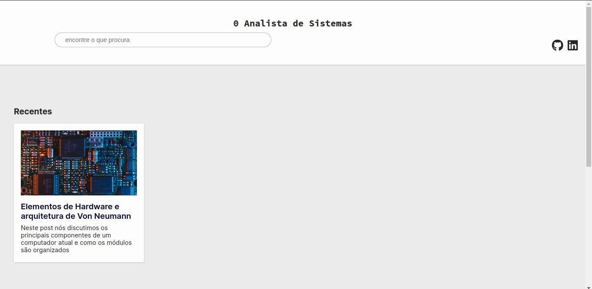
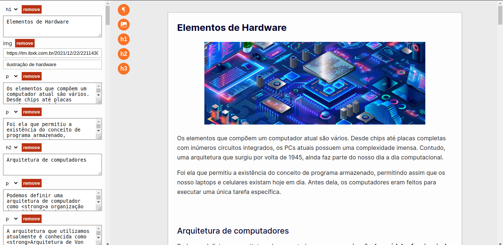

# 0AS

## Objetivo

Fornecer para pessoas conteúdo de qualidade sobre o ramo da tecnologia e solidificar meus
conhecimentos na área. Contudo, se você quiser utilizar este repositório,você pode criar um blog do
que achar melhor já que os posts são inseridos de forma dinâmica.

também foi desenvolvido uma área de administrador onde é possível criar e deletar posts mais
facilmente. Isso foi necessário porque o projeto utiliza o CRM da Sanity para salvar os dados dos
posts. Eles tem um área de administração, mas para simplificar o processo acredito que ter uma área
de admin no próprio site facilite o processo.

Além disso também há um editor simplificado para criação de posts.

Para autenticação o projeto utiliza o firebase.

## Como rodar

Para rodar a aplicação será preciso configurar alguns serviços:

-  Todas as informações e variáveis de serviços externos estão presentes no diretório "services".

-  Possuir um projeto criado na
   <a href="https://www.sanity.io/docs/create-a-sanity-project">Sanity.io</a>. Crie um projeto
   utilizando <strong>npm create sanity@latest</strong>, dê o nome ao projeto, no "dataset" digte
   production e escolhar um projeto sem schemas definidos.Você terá que fazer login para continuar,
   mas basta seguir os passos informados no terminal.

-  Quando o projeto estiver criado, na pasta <strong>schemas</strong> crie dois arquivos, um chamado
   post.ts(ou .js) e outro chamado posts.ts. Para saber como os arquivos devem ficar ao fim do
   processo vá até o fim deste arquivo README. Depois de criados, basta importar os arquivos em
   /schemas/index.ts e incluí-los no array.

-  Para permitir o acesso ao seu projeto, digite "sanity manage" no terminal e siga até o link. Vá
   até o menu "API" e em "CORS origins" adicione o host "http://localhost:3000" ou qualquer outra
   porta que você esteja utilizando para o projeto, sem esquecer de marcar a opção "allow
   credentials".

-  Na mesma tela, vá em "tokens" e adicione um novo token marcando como editor. Copie o token para
   utilizá-lo no projeto.

-  Para configurar o firebase, basta criar um projeto, em seguida criar um app web e copiar as
   informações para o seu arquivo .env. A authenticação do administrador é feita através de um email
   e senha. Siga até ao console do firebase e vá em "authentication". Em "Sign-in method" clique em
   "Add new provider" e selecione "email/password".

-  Ainda em authentication vá em "Users" e adicione um novo usuário administrador, criando seu email
   e senha.

-  Para configurar o firebase admin SDK (necessário para a comunicação do lado do servidor), vá em
   configurações e em "Service accounts" e clique em "Generate new private key". Será executado o
   download de um arquivo json vários dados. Adicione os dados necessários para o projeto no arquivo
   .env.

-  Agora que os serviços externos foram configurados, clone este repositório e execute "npm
   install". Adicione todas as informações requisitadas no diretório "services" em um arquivo .env e
   execute "npm run dev" para rodar o seu projeto localmente.

## Schema do arquivo post.ts (sanity)

## schema do arquivos posts.ts (sanity)

### Observação

Este projeto ainda está em desenvolvimento
